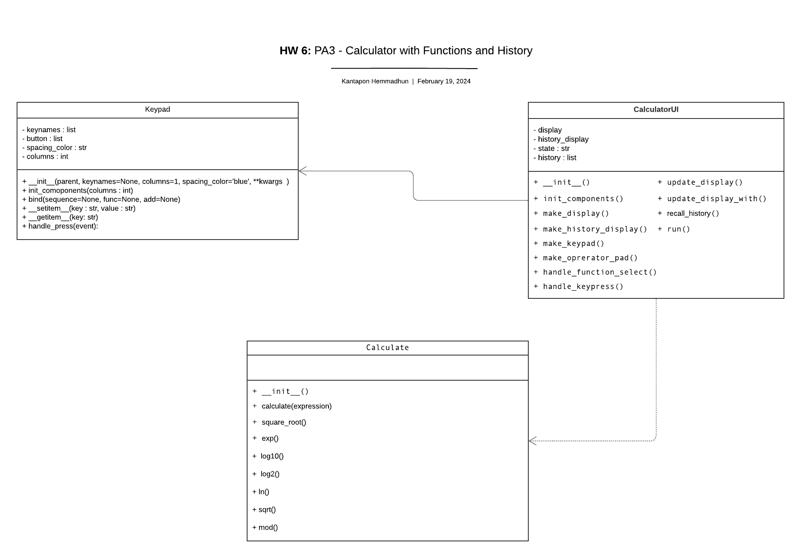

# Calculator Application
## Files for PA3: Calculator with Functions and History

| file               | For                                                        |
|--------------------|------------------------------------------------------------|
| `calculator_ui.py` | CalculatorUI, with 2 keypads and display area.             |
| `keypad.py`        | Keypad class                                               |
| `main.py`          | script to start the UI                                     |
| `calculate.py`     | provides methods for performing mathematical calculations. |

## Features
1. Basic arithmetic operations: addition (+), subtraction (-), multiplication (*), and division (/)
2. Advanced mathematical functions: exponentiation (^), logarithms (log10, log2, ln), square root (sqrt), and modulus (mod)
3. Special keys: delete (DEL), clear (CLR), and parentheses ()
4. History display for recalling previous calculations

## UML Diagram

